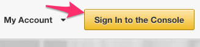

# Tutorial 1 - Hosting A Web Map to Amazon S3

## Description

This tutorial will walk you through the steps necessary to set up and deploy a Esri ArcGIS application from Esri's Github site  to Amazon's S3 (Simple Storage Service) product.  Using S3 you can host a static web application.  A static web application may sound super old school, but if you are using SaaS platforms such as ArcGIS.com, Mapbox, Cartodb, Firebase, and others you can make API calls via RESTful requests.  

## Why would I want to use S3 hosting rather than my own server?
* [Pennies a month!](http://aws.amazon.com/s3/pricing/)
* Perfect for campaign web maps

## Why would I not want to use S3 hosting rather than my own server?
* Application Server Side Code (.NET, Node.js, RoR, Java, PHP, and others)
* Security
* Load Balancing

## Pre-requisites

* ArcGIS.com Account
* Amazon AWS Account
* Amazon S3 File Managment application such as [S3CMD](https://github.com/s3tools/s3cmd) if on Mac/Linux or [S3 Browser](http://s3browser.com/) if on Windows.

## Setup development environment

[New to Github? Get started here.](https://github.com/)

For the purpose of this tutorial we will be using Esri's [geoform-template application](https://github.com/Esri/geoform-template-js).  The [GeoForm](https://github.com/Esri/geoform-template-js) is a configurable template for form based data editing of a Feature Service.  The application is built for a mobile first approach.

<b> Step 1 </b> - Follow the instructions outlined in the [deployment](https://github.com/Esri/geoform-template-js#deploying) section of the geoform-template-application to setup your local environment.

<b> Step 2 </b> - Log into the Amazon EC2 Management Console 
 

<b>NOTE:</b> You should never use your Root AWS credentials when signing into the Amazon Management Console.  You should create separate IAM users.  See [Best Practices for Managing AWS Access Keys](http://docs.aws.amazon.com/general/latest/gr/aws-access-keys-best-practices.html)
for more information.

<b> Step 3 </b> - Create New S3 Bucket
* Create a new s3 bucket

## Resources

* https://aws.amazon.com/articles/Amazon-S3/5050
* https://github.com/Esri/geodev-hackerlabs
* http://blogs.esri.com/esri/arcgis/2014/09/25/the-geoform-graduates/

